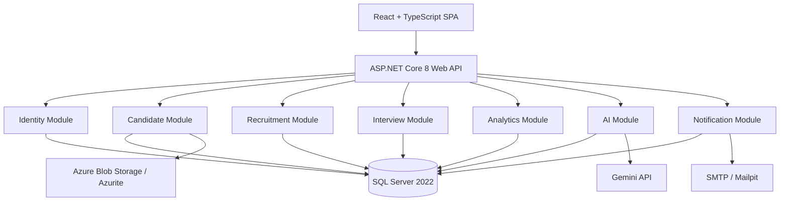

<div align="center">

# TalentIQ

### AI-Powered Job Search, Recruitment, and Talent Management Platform

A modular recruitment platform that connects candidates, recruiters, hiring managers, and administrators through an end-to-end hiring workflow—supported by explainable candidate matching, consent-aware talent retention, interview management, and recruitment analytics.

<br />


</div>

---

## Table of Contents

- [Overview](#overview)
- [The Problem](#the-problem)
- [Core Capabilities](#core-capabilities)
- [System Roles](#system-roles)
- [Architecture](#architecture)
- [Module Breakdown](#module-breakdown)
- [Design Decisions and Patterns](#design-decisions-and-patterns)
- [Technology Stack](#technology-stack)
- [Project Structure](#project-structure)
- [Getting Started](#getting-started)
- [Development URLs](#development-urls)
- [API Documentation](#api-documentation)
- [Validation and Testing](#validation-and-testing)
- [Demo Workflow](#demo-workflow)
- [Security Notes](#security-notes)
- [Team Contributions](#team-contributions)
- [Academic Context](#academic-context)

---

## Overview

**TalentIQ** is an AI-assisted recruitment and talent management platform designed to support the complete hiring lifecycle:

1. Candidate registration and profile creation
2. Job discovery and application submission
3. Explainable résumé-to-job matching
4. Recruiter pipeline management
5. Interview scheduling and evaluation
6. Hiring decisions and notifications
7. Recruitment analytics
8. Consent-based Talent Pool retention and re-engagement

The platform is implemented as a **modular monolith** using a single deployable ASP.NET Core backend. Each business module owns its domain logic and is separated into Domain, Application, and Infrastructure layers.

---

## The Problem

Traditional recruitment systems commonly rely on basic keyword matching and often discard strong candidates after an unsuccessful application.

TalentIQ addresses these limitations by providing:

- **Explainable matching** instead of displaying only a score
- **Matched and missing skill breakdowns**
- **Candidate strengths, growth areas, and recommendations**
- **Structured recruitment-stage management**
- **Consent-aware candidate retention**
- **Long-term candidate improvement tracking**
- **Data-driven recruitment dashboards**
- **A fallback analysis path when the external AI service is unavailable**

---

## Core Capabilities

### Identity and Access Management

- User registration and login
- JWT access and refresh tokens
- Role-based access control
- Organization and department-aware users
- Administrative user provisioning
- Protected routes and API endpoints
- Authorization checks returning `403 Forbidden` for restricted access

### Candidate Experience

- Candidate profile management
- Résumé upload
- Skills, education, experience, projects, certifications, languages, and achievements
- Job discovery and application submission
- Application tracking
- Talent Pool consent management

### Recruitment Management

- Create, edit, publish, and close job postings
- View recruiter-managed Draft, Published, and Closed jobs
- Candidate pipeline grouped by recruitment stage
- Controlled stage transitions
- Candidate rejection and shortlisting
- Candidate directory and shortlist management

### Explainable AI

- Résumé-to-job match analysis
- Overall match score
- Matched and missing skills
- Key strengths and growth areas
- Recommendations and executive summary
- External AI provider support
- Deterministic fallback execution for service unavailability

### Interview and Evaluation

- Interview scheduling and rescheduling
- Calendar invite generation
- Interviewer assignment
- Candidate evaluation scorecards
- Hiring-manager review workflow
- Interview reminder background service

### Recruitment Analytics

- Total applications
- Shortlisted candidates
- Interviews scheduled
- Offers accepted
- Average time to hire
- Hiring funnel
- Recruiter performance indicators
- Estimated days to fill as a transparent statistical projection

### Talent Pool

- Explicit candidate consent states
- Candidate skills and improvement indicators
- Monthly progress-report generation
- Trending and re-engagement readiness
- Candidate recommendation status
- Re-engagement invitations for future roles

---

## System Roles

| Role | Main Responsibilities |
|---|---|
| **Candidate** | Maintains a profile, uploads a résumé, discovers jobs, applies, tracks applications, and controls Talent Pool consent |
| **Recruiter** | Manages job postings, reviews candidates, controls pipeline stages, uses Talent Pool features, and views recruitment analytics |
| **Hiring Manager** | Reviews shortlisted candidates, participates in interviews, completes evaluations, and supports hiring decisions |
| **Admin** | Manages users, roles, organizational settings, monitoring, and protected administrative operations |

---

## Architecture

TalentIQ uses a **modular monolith** architecture.



### Architectural Characteristics

- One deployable backend
- Independently organized business modules
- Domain, Application, and Infrastructure separation
- A single SQL Server database with **schema-per-module ownership**
- Dependency injection for infrastructure abstractions
- MediatR-based requests and selected cross-module notifications
- React SPA consuming RESTful API endpoints
- Local infrastructure provided through Docker Compose

### Database Ownership

The application uses one SQL Server instance while preserving module boundaries through schemas such as:

- `identity`
- `candidate`
- `recruitment`
- `interview`
- `analytics`
- `ai`

This approach keeps local deployment simple while making data ownership explicit.

---

## Module Breakdown

| Module | Responsibility |
|---|---|
| **Identity** | Authentication, JWT tokens, refresh tokens, RBAC, users, roles, organizations, departments, and audit-related security concerns |
| **Candidate** | Candidate profiles, résumé storage, skills, education, experience, projects, certifications, and candidate preferences |
| **Recruitment** | Job postings, applications, pipeline stages, candidate movement, rejection, shortlisting, and recruiter-managed workflows |
| **Interview** | Scheduling, rescheduling, reminders, calendar invites, interviewer assignment, and evaluation scorecards |
| **Analytics** | Recruitment KPIs, hiring funnel, recruiter performance, time-to-hire information, and Talent Pool progress reports |
| **AI** | Explainable candidate matching, question generation, AI-provider integration, and fallback analysis |
| **Notification** | Email notifications and event-driven communication for important recruitment activities |

---

## Design Decisions and Patterns

TalentIQ applies several software architecture and object-oriented design practices:

| Decision / Pattern | Application |
|---|---|
| **Dependency Injection** | Modules depend on abstractions such as repositories and services rather than concrete implementations |
| **CQRS-style Requests** | Commands and queries separate write and read intentions in the application layer |
| **Observer / Notifications** | MediatR notifications support selected event-driven reactions without direct module-to-module calls |
| **Strategy Pattern** | AI-provider behavior can fall back to deterministic rule-based analysis |
| **Builder-style Construction** | Complex calendar-invite content can be assembled in structured steps |
| **Memento-style Snapshot** | Candidate state can be captured at a point in time for later growth comparison |
| **Repository Pattern** | Persistence logic is separated from domain and application concerns |
| **Schema-per-Module** | Each module has explicit ownership of its database objects |

---

## Technology Stack

### Backend

- .NET 8
- ASP.NET Core Web API
- Entity Framework Core
- SQL Server 2022
- MediatR
- JWT authentication
- Swagger / OpenAPI
- Background services
- MailKit-compatible SMTP integration

### Frontend

- React
- TypeScript
- Vite
- REST API integration
- Role-aware navigation and route protection

### Infrastructure and Integrations

- Docker Compose
- SQL Server container
- Azurite for local Azure Blob Storage
- Mailpit for local email testing
- Gemini API for AI-assisted functionality

---

## Project Structure

```text
talentIQ/
├── client/
│   └── talentiq-web/                 # React + TypeScript frontend
│
├── src/
│   ├── Modules/
│   │   ├── Identity/
│   │   ├── Candidate/
│   │   ├── Recruitment/
│   │   ├── Interview/
│   │   ├── Analytics/
│   │   ├── AI/
│   │   └── Notification/
│   │
│   ├── Shared/
│   │   └── TalentIQ.Shared.Kernel/
│   │
│   └── TalentIQ.Api/                 # API composition root and controllers
│
├── tests/                             # Automated and integration tests
├── docker-compose.yml                 # Local infrastructure
├── .env.example                       # Environment-variable template
└── TalentIQ.sln                       # .NET solution
```

Within a typical backend module:

```text
ModuleName/
├── ModuleName.Domain/
├── ModuleName.Application/
└── ModuleName.Infrastructure/
```

---

## Getting Started

### Prerequisites

Install the following:

- .NET 8 SDK
- Node.js and npm
- Docker Desktop
- Git

### 1. Clone the Repository

```bash
git clone https://github.com/TalentIq-team/talentIQ.git
cd talentIQ
git switch develop
git pull origin develop
```

### 2. Configure Environment Variables

Create the backend environment file from the provided template:

```bash
cp .env.example .env
```

Review `.env` and provide the required local values.

Create the frontend environment file:

```bash
cat > client/talentiq-web/.env.local <<'EOF'
VITE_API_BASE_URL=http://localhost:5000
EOF
```

> Never commit `.env`, `.env.local`, access tokens, database passwords, or external API keys.

### 3. Start Local Infrastructure

```bash
docker compose up -d
docker compose ps
```

The Docker environment starts:

- SQL Server
- Azurite
- Mailpit

### 4. Start the Backend

Open a new terminal:

```bash
dotnet restore
dotnet run --project src/TalentIQ.Api/TalentIQ.Api.csproj
```

On startup, the Development environment applies Entity Framework migrations and checks the seeded demonstration data.

### 5. Start the Frontend

Open another terminal:

```bash
cd client/talentiq-web
npm ci
npm run dev
```

---

## Development URLs

| Service | URL |
|---|---|
| Frontend | `http://localhost:5173` |
| Backend API | `http://localhost:5000` |
| Swagger / OpenAPI | `http://localhost:5000/swagger` |
| Mailpit | `http://localhost:8025` |
| SQL Server | `localhost,11433` |
| Azurite Blob Service | `http://localhost:10000` |

---

## API Documentation

Interactive API documentation is available through Swagger:

```text
http://localhost:5000/swagger
```

Representative endpoints include:

```http
POST /api/v1/auth/login
GET  /api/v1/jobs/manage
GET  /api/v1/analytics/dashboard
GET  /api/v1/talent-pool/dashboard
POST /api/v1/talent-pool/run-monthly-analysis
POST /api/v1/talent-pool/reengage
```

Example Talent Pool analysis response:

```json
{
  "message": "Monthly Talent Pool analysis completed.",
  "reportsGenerated": 1
}
```

---

## Validation and Testing

### Backend Build

```bash
dotnet build src/TalentIQ.Api/TalentIQ.Api.csproj
```

### Frontend Lint

```bash
cd client/talentiq-web
npm run lint
```

### Frontend Production Build

```bash
npm run build
```

### Automated Tests

```bash
cd ../..
dotnet test TalentIQ.sln
```

### Manual Validation

The platform has been manually validated across key recruiter workflows, including:

- Authentication and recruiter redirect
- Role-aware sidebar navigation
- Draft job creation
- Job publication and closure
- Candidate pipeline grouping
- Controlled stage transitions
- Candidate rejection
- Talent Pool consent visibility
- Monthly Talent Pool analysis
- Candidate re-engagement
- Recruiter user provisioning
- Candidate-route and Admin-route access restrictions
- Swagger API execution with successful HTTP responses

---

## Demo Workflow

A recommended end-to-end demonstration flow:

1. Log in as a Candidate
2. Complete the candidate profile and upload a résumé
3. Apply for a published position
4. Log in as a Recruiter
5. Review the application and explainable match result
6. Move the candidate through the recruitment pipeline
7. Schedule an interview
8. Complete the Hiring Manager evaluation
9. Review recruitment analytics
10. Run the Talent Pool monthly analysis
11. Re-engage a suitable candidate
12. Confirm notification delivery through Mailpit

---

## Security Notes

- Secrets must remain in local environment files
- Demo accounts and seeded records are intended for Development only
- JWT access and refresh tokens must not be exposed in screenshots or logs
- Role restrictions are enforced by protected backend endpoints
- Candidate Talent Pool participation requires explicit consent
- External AI keys must never be committed
- Production deployments should use managed secret storage, HTTPS, hardened database credentials, and production-grade email and blob services

---

## Team Contributions

| Team Member | Primary Contribution |
|---|---|
| **Keshan** | Team leadership, shared infrastructure, Notification module, Docker environment, and integration |
| **Yathushi** | Identity and access-management workflows |
| **Dhanu** | Candidate and Recruitment modules |
| **Thilina Wickramanayake** | AI module and fallback functionality |
| **Senarathna S.A.V.C.** | Interview and Hiring Manager workflows |
| **Tharindu Lakshan — 37160** | Analytics and Talent Pool modules |

Development followed a shared-repository workflow using short-lived branches, code reviews, integration through `develop`, and coordinated module ownership.

---

## Academic Context

TalentIQ was developed for **SE205.3 — Software Architecture** as an academic group project.

The project demonstrates:

- Modular architecture
- Layered module design
- REST API development
- Role-based security
- Database migrations and data ownership
- Third-party integration
- Resilient fallback behavior
- Frontend–backend integration
- Collaborative Git-based development
- End-to-end software demonstration

---

<div align="center">

### TalentIQ — Better Matches. Better Decisions. Stronger Talent Pipelines.

</div>
